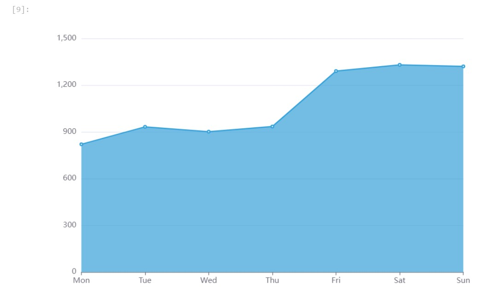
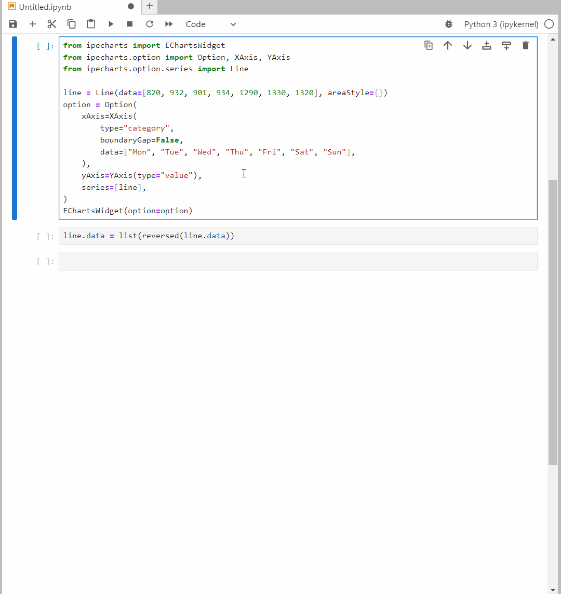

# ipecharts - Apache Echarts Jupyter Widget

[](https://github.com/trungleduc/ipecharts/actions/workflows/build.yml)
[](https://trungleduc.github.io/ipecharts/)

`ipecharts` brings interactive widgets based on [Apache ECharts](https://echarts.apache.org/en/index.html) charting library to the Jupyter ecosystem. By using the Jupyter Widget protocol, `ipecharts` is fully compatible with other widget libraries and tools in the Jupyter ecosystem.

https://github.com/trungleduc/ipecharts/assets/4451292/c6e73b4d-61ef-4098-a274-92233d0801b0

> [!NOTE]  
> [`pyecharts`](https://pyecharts.org) also supports using Echarts in the notebook, but they are not using Jupyter Widget like `ipecharts`. In this library, HTML code is injected into the notebook to render the chart.

## Requirements

- ipywidgets >= 8.0.0

## Installation

To install the extension, execute:

```bash
pip install ipecharts
```

or with conda:

```bash
conda install -c conda-forge  ipecharts
```

## Usage

`ipecharts` widgets are generated automatically from `ECharts 5.5.0`. It provides two high-level widgets to create charts in notebooks: `EChartsRawWidget` and `EChartsWidget`.

### Create charts using `EChartsRawWidget`

`EChartsRawWidget` is a simple widget to render `ECharts` option dictionary. It is fully compatible with the JavaScript version of `ECharts`. Here is an example of converting the [following JS example](https://echarts.apache.org/examples/en/editor.html?c=area-basic):

```javascript
import * as echarts from 'echarts';

var chartDom = document.getElementById('main');
var myChart = echarts.init(chartDom);
var option;

option = {
  xAxis: {
    type: 'category',
    boundaryGap: false,
    data: ['Mon', 'Tue', 'Wed', 'Thu', 'Fri', 'Sat', 'Sun']
  },
  yAxis: {
    type: 'value'
  },
  series: [
    {
      data: [820, 932, 901, 934, 1290, 1330, 1320],
      type: 'line',
      areaStyle: {}
    }
  ]
};

option && myChart.setOption(option);
```

into using `EChartsRawWidget`:

```python
from ipecharts import EChartsRawWidget

option = {
  'xAxis': {
    'type': 'category',
    'boundaryGap': False,
    'data': ['Mon', 'Tue', 'Wed', 'Thu', 'Fri', 'Sat', 'Sun']
  },
  'yAxis': {
    'type': 'value'
  },
  'series': [
    {
      'data': [820, 932, 901, 934, 1290, 1330, 1320],
      'type': 'line',
      'areaStyle': {}
    }
  ]
}

EChartsRawWidget(option=option)
```



### Create charts using `EChartsWidget`

While the raw widget can render the charts correctly, it lacks the interactivity of a Jupyter widget. `ipecharts` provides `EChartsWidget` and configuration classes for nearly all available options of ECharts to correct this issue.

Here is the equivalent of the above chart but using `EChartsWidget`:

```python
from ipecharts import EChartsWidget
from ipecharts.option import Option, XAxis, YAxis
from ipecharts.option.series import Line

line = Line(data=[820, 932, 901, 934, 1290, 1330, 1320], areaStyle={})
option = Option(
    xAxis=XAxis(
        type="category",
        boundaryGap=False,
        data=["Mon", "Tue", "Wed", "Thu", "Fri", "Sat", "Sun"],
    ),
    yAxis=YAxis(type="value"),
    series=[line],
)
EChartsWidget(option=option)
```

While it looks more verbose, the advantage is the reactivity. We can update the line data and have the chart updated automatically.



### Configure `EChartsWidget` with `traitlets`

Each key in the [option dictionary](https://echarts.apache.org/en/option.html#title) of ECharts has an equivalent configuration class with the same name. These classes contain traits with the same name as the corresponding ECharts option. Any change to these traits will be propagated to the top-level widget, and the chart will be updated automatically.

For instance, you can compare the scatter option of ECharts at https://echarts.apache.org/en/option.html#series-scatter.type and the equivalent Scatter class in the [ipecharts documentation](https://ipecharts.readthedocs.io/en/latest/api/ipecharts.option.seriesitems.html#module-ipecharts.option.seriesitems.scatter). The Python class is generated automatically from the ECharts option.

By using Traitlets to configure your widget, you can use EChartsWidget with other widgets in the Jupyter ecosystem. Here is an example of controlling the chart with an ipywidgets Button:

```python
from ipecharts.option import Option, XAxis, YAxis
from ipecharts.option.series import Line
from ipywidgets.widgets import Button

line = Line(smooth=True, areaStyle={}, data=numpy.random.rand(10).tolist())
option = Option(
    xAxis=XAxis(type="category"),
    yAxis=YAxis(type="value"),
    series=[line],
)
chart = EChartsWidget(option=option)

button = Button(description="Generate data")
def on_button_clicked(b):
    data = numpy.random.rand(10).tolist()
    line.data = data

button.on_click(on_button_clicked)

display(button, chart)
```


## Contributing

### Development install

Note: You will need NodeJS to build the extension package.

The `jlpm` command is JupyterLab's pinned version of
[yarn](https://yarnpkg.com/) that is installed with JupyterLab. You may use
`yarn` or `npm` in lieu of `jlpm` below.

```bash
# Clone the repo to your local environment
# Change directory to the ipecharts directory
# Install package in development mode
pip install -e "."
# Link your development version of the extension with JupyterLab
jupyter labextension develop . --overwrite
# Rebuild extension Typescript source after making changes
jlpm build
```

You can watch the source directory and run JupyterLab at the same time in different terminals to watch for changes in the extension's source and automatically rebuild the extension.

```bash
# Watch the source directory in one terminal, automatically rebuilding when needed
jlpm watch
# Run JupyterLab in another terminal
jupyter lab
```

With the watch command running, every saved change will immediately be built locally and available in your running JupyterLab. Refresh JupyterLab to load the change in your browser (you may need to wait several seconds for the extension to be rebuilt).

By default, the `jlpm build` command generates the source maps for this extension to make it easier to debug using the browser dev tools. To also generate source maps for the JupyterLab core extensions, you can run the following command:

```bash
jupyter lab build --minimize=False
```

### Development uninstall

```bash
pip uninstall ipecharts
```

In development mode, you will also need to remove the symlink created by `jupyter labextension develop`
command. To find its location, you can run `jupyter labextension list` to figure out where the `labextensions`
folder is located. Then you can remove the symlink named `ipecharts` within that folder.

### Packaging the extension

See [RELEASE](RELEASE.md)
